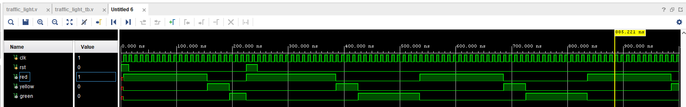
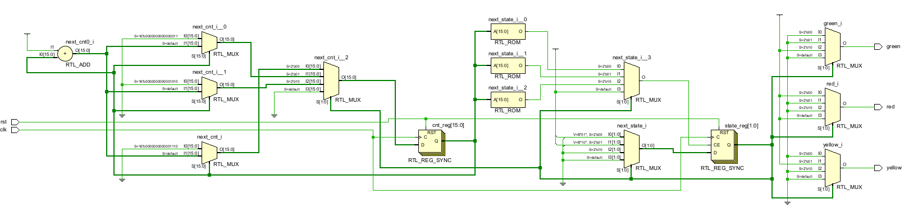

## Simulation Results

The simulation confirms that the traffic light controller operates correctly according to the FSM specification.

- The FSM cycles through **RED → YELLOW → GREEN → RED** in the correct order.
- Each light remains active for the expected number of clock cycles defined by the timing parameters.
- At any time, **only one light is active**, ensuring safe one-hot behavior.
- When reset (`rst`) is asserted during operation, the FSM **returns to the safe state (RED)** and restarts the sequence correctly.

### Waveform Result
The waveform below shows the clock, reset, and output signals.  
It verifies correct state transitions, timing control, and mid-operation reset behavior.

---

## RTL Schematic

The synthesized RTL schematic illustrates:
- A finite state machine with three states
- A counter used for state timing
- Combinational logic for next-state and output generation
- Sequential registers for state and counter storage

---

## Conclusion

The simulation and RTL schematic validate that the traffic light controller is correctly implemented using a clean FSM-based RTL architecture.  
The design shows deterministic behavior, correct timing control, and reliable reset handling, making it suitable as a reusable control block and a solid reference for FSM-based digital designs.